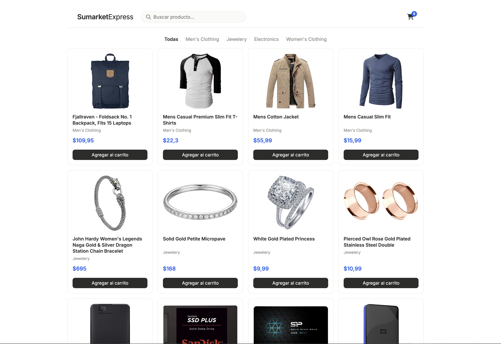
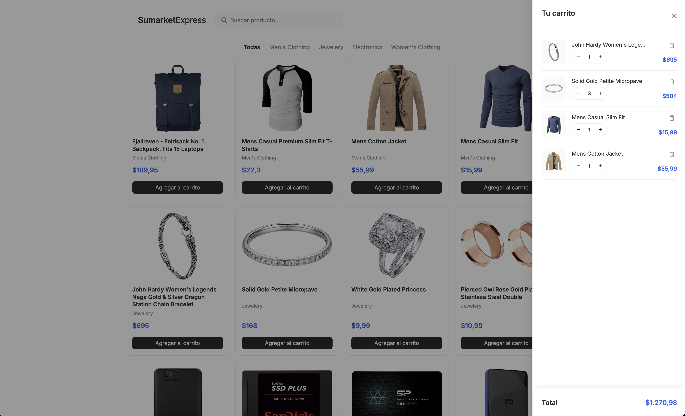

# 🛒 SumarketExpress

Tienda e-commerce de una sola página (SPA) construida desde cero con **React** y **Vite**, desarrollada como proyecto personal para reforzar y demostrar mis habilidades de desarrollo front-end.

Los productos se obtienen en tiempo real desde una API externa pública y se normalizan a un formato propio antes de mostrarse en el catálogo. Incluye buscador, filtros por categoría y un carrito de compras completo con persistencia en el navegador.

## 🔗 Demo en vivo

👉 [https://wdevil5.github.io/tienda-react/](https://wdevil5.github.io/tienda-react/)

## 📸 Vista previa





## 🛠️ Tecnologías

- **React 19** (Hooks: `useState`, `useEffect`)
- **Vite** como build tool y servidor de desarrollo
- **CSS Modules** + variables CSS (design tokens)
- **JavaScript (ES6+)**
- **[Fake Store API](https://fakestoreapi.com/)** como fuente de datos de productos
- **Font Awesome** para iconografía
- **Git** y **GitHub**
- **GitHub Pages** + **gh-pages** para el despliegue

## ✨ Características

- **Catálogo de productos** obtenido desde una API externa con `fetch` dentro de `useEffect`, con estado de carga ("Cargando productos...") mientras llega la respuesta.
- **Manejo de errores de red**: si la petición falla o el servidor responde con error, se muestra un mensaje y un botón "Reintentar" que vuelve a disparar la carga (`catch` / `finally` sobre el `fetch`).
- **Normalización de datos**: la respuesta de la API se transforma al formato propio que usa la aplicación, desacoplando la UI de la estructura externa.
- **Buscador en tiempo real** mediante un input controlado.
- **Filtros por categoría** generados dinámicamente a partir de los productos disponibles (usando `Set` para obtener categorías únicas, sin hardcodearlas).
- **Categorías con overflow controlado**: se muestran las primeras categorías y el resto queda agrupado en un desplegable "Explorar X más", para no saturar la barra de filtros.
- **Paginación tipo "cargar más"**: el catálogo no muestra todos los productos filtrados de una vez, sino en tandas, con un botón que indica cuántos productos más hay disponibles.
- **Carrito de compras completo**:
  - Agregar productos (si ya existe en el carrito, aumenta la cantidad en vez de duplicar la fila).
  - Eliminar productos.
  - Ajustar cantidades con botones `+` / `−` (con un mínimo de 1 unidad).
  - Subtotal por producto (precio × cantidad) y cálculo del total en tiempo real como estado derivado, sin duplicar información.
- **Persistencia del carrito en `localStorage`**, usando inicialización perezosa de `useState` para que el carrito sobreviva a un refresco de página.
- **Contador de ítems** visible en el ícono del carrito, en el header.
- **Carrito como panel lateral (drawer)** deslizante, con animación de entrada/salida, overlay de fondo y una estructura escalable: cabecera fija, lista de productos con scroll y total fijo en la parte inferior.
- **Diseño responsive** para móvil, tablet y escritorio: grid de productos adaptable (4 / 3 / 2 / 1 columnas según el ancho) y header reorganizado en pantallas pequeñas.
- **Footer con navegación e identidad del proyecto**: enlaces por ancla a las secciones principales y enlaces a redes sociales.
- **Atributos de accesibilidad (ARIA)** como `aria-expanded`, `aria-controls` y `aria-label` en botones y menús desplegables, para que su estado sea comprensible también con lectores de pantalla.
- **Sistema de diseño propio** basado en design tokens (variables CSS para colores, espaciado y tipografía), con una estética minimalista y sobria.

## 📚 Lo que aprendí

Este proyecto fue y actualmente es mi campo de práctica para consolidar conceptos fundamentales de React y buenas prácticas de front-end:

- Construcción de **componentes reutilizables** y comunicación entre ellos mediante **props** (con destructuring).
- Renderizado de listas con `map()` y uso correcto de `key`.
- Manejo de estado con `useState` y efectos secundarios con `useEffect`.
- **Estado derivado**: calcular valores (como el total del carrito) en lugar de duplicarlos en el estado.
- **Inmutabilidad** al actualizar el estado, usando spread, `map` y `filter` en vez de mutar directamente.
- **Lifting state up**: elevar el estado al ancestro común y pasar funciones por props para modificarlo desde componentes hijos.
- **Renderizado condicional** con el operador `&&` y el operador ternario.
- Manejo de **inputs controlados**.
- Encapsulamiento de estilos por componente con **CSS Modules**.
- Consumo de **APIs externas** con `fetch`, funciones `async` y manejo de estados de carga, error y reintento (`catch` / `finally`).
- **Paginación en el cliente** con constantes de configuración (en vez de números mágicos) para controlar cuántos productos y categorías se muestran a la vez.
- Nociones básicas de **accesibilidad** con atributos ARIA (`aria-expanded`, `aria-controls`, `aria-label`) en elementos interactivos.
- **Diseño responsive** con media queries, pensado para escalar a distintos tamaños de pantalla.

## 💻 Cómo ejecutarlo localmente

```bash
# Clonar el repositorio
git clone https://github.com/wDEVil5/tienda-react.git

# Entrar a la carpeta del proyecto
cd tienda-react

# Instalar las dependencias
npm install

# Levantar el servidor de desarrollo
npm run dev
```

La aplicación quedará disponible en `http://localhost:5173/`.

## 🚀 Cómo desplegarlo

El proyecto está configurado para desplegarse en GitHub Pages mediante `gh-pages`:

```bash
npm run deploy
```

Este comando genera el build de producción (`npm run build`) y publica el contenido de la carpeta `dist` en la rama `gh-pages` del repositorio.

---

Proyecto desarrollado por **Wilnes** ([@wDEVil5](https://github.com/wDEVil5)) como estudiante de Ingeniería en Computación e Informática, en el marco de mi proceso de aprendizaje de React.
