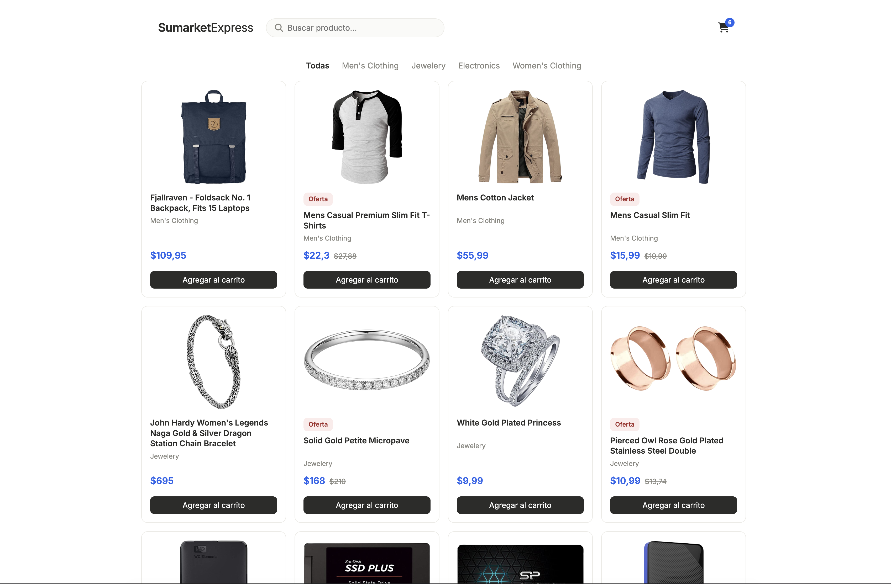
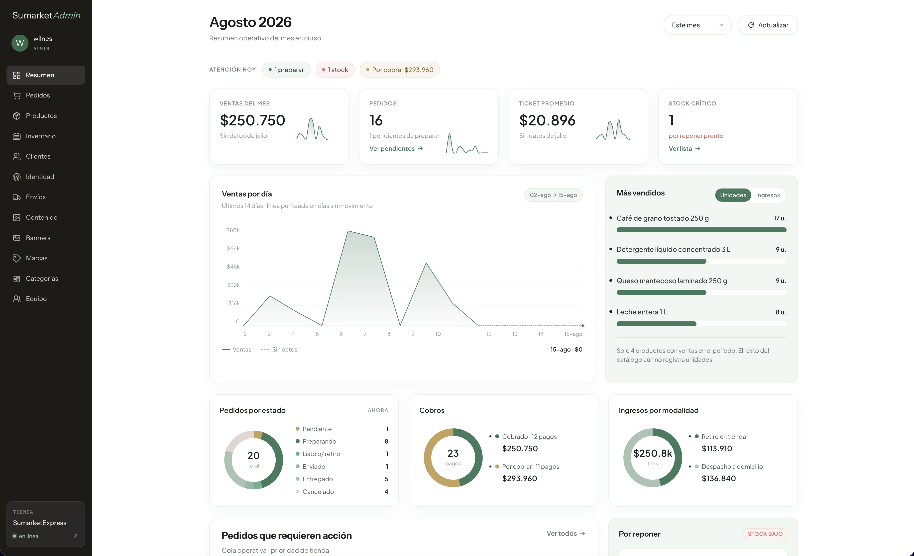

<div align="center">

# 🛒 SumarketExpress

**E-commerce full-stack de un minimarket** — tienda en React sobre una API propia
construida con Express, PostgreSQL y Prisma. Proyecto personal de aprendizaje.


[**🌐 Ver demo en vivo**](https://sumarketexpress.sumarket.workers.dev/)

</div>

> La demo consume la **API propia desplegada** (Render + Supabase). Si el plan
> gratuito de la API está dormido y la primera petición expira, el catálogo cae
> automáticamente a [Fake Store](https://fakestoreapi.com/) como respaldo; recargar lo soluciona.




## ✨ Stack

**Frontend** — React 19, React Router, Vite. Hooks, Context API y `useReducer`;
CSS Modules + design tokens para un sistema visual responsive. Vitest + Testing Library.

**Backend** — Node.js + Express 5 (API REST), PostgreSQL 16 con Prisma 7 y
migraciones versionadas, Zod para validar todo contrato de entrada. Argon2id y
sesiones con token hasheado en cookie `httpOnly`; login con Google (verificación
del ID token en el servidor). Cloudinary + Sharp para imágenes y Brandfetch para logos de marcas, correo transaccional
(Brevo) y Mercado Pago Checkout Pro con webhook verificado. `node:test` + Supertest.

## 🧩 Funcionalidades

### 🛍️ Tienda pública
- Inicio editorial: **carrusel de banners** administrable, filas de destacados,
  **lo más vendido** (ranking real de ventas) y ofertas — sin catálogo embutido.
- Navegación tipo supermercado: **mega-menú** de categorías con subcategorías y
  **buscador** con **autocompletado en vivo**, historial de búsquedas y resultados
  **tolerantes a la separación** (escribir "camposur" encuentra la marca "Campo Sur").
- **Páginas de listado** por categoría/subcategoría/búsqueda/ofertas con breadcrumb,
  orden, paginación, **píldoras contextuales** que bajan al siguiente nivel de la
  taxonomía y **sidebar de filtros** (marcas, rango de precio y atributos, calculados
  por facetas del servidor).
- Ficha de producto con galería, **panel de compra sticky**, **reseñas y calificaciones**,
  y filas con scroll de **productos similares** y "te podrían interesar".
- **Barra de progreso** de carga ligada a la actividad de red real, y navegación que
  **precarga la ficha** antes de mostrarla (sin páginas a medio cargar).
- **Reseñas con compra verificada**: solo califica quien compró el producto; el promedio y
  las estrellas se ven también en las tarjetas del catálogo.
- **Favoritos** (lista de deseos por cuenta): corazón en tarjetas y ficha, con página propia.
- **Modal de acceso**: el login/registro se abre sobre la misma página (sin navegar), con un
  mensaje según la acción y reanudándola al iniciar sesión.
- Carrito persistente (`localStorage`) con deshacer y drawer accesible.
- **Checkout** en dos pasos (retiro o despacho), cotización en vivo y pago iniciado desde el
  servidor; si falta stock, muestra qué productos y permite **ajustar las cantidades en línea**.
- Cuentas de cliente: registro/login (correo o Google), recuperación de contraseña, **panel
  con resumen**, direcciones, favoritos, historial y detalle de pedidos.
- Responsive, con foco visible y navegación por teclado.

### 🔐 Panel de administración
Resumen (KPIs, gráficos SVG sin librerías), Pedidos (comanda + CSV), Productos
(con **taxonomía de 3 niveles asignable** por producto y atributos por categoría),
Inventario (con bitácora de movimientos), Clientes, Categorías (**taxonomía de 3
niveles + atributos configurables**), Marcas, Envíos, Identidad, Contenido (Markdown),
Banners, **Reseñas** (moderación) y Equipo. Control por rol (`ADMIN` / `OPERADOR`).

### ⚙️ API propia (garantías del servidor)
- Los **montos, descuentos, envío y stock los recalcula el servidor**: el cliente
  solo manda productos, cantidades y modalidad de entrega.
- **Reserva atómica de stock** y máquina de estados por modalidad de entrega, con
  snapshots históricos por pedido.
- Disponibilidad honesta (`disponible` = stock − reservado) y suscripción "Avísame".
- **Facetas** de catálogo (marcas, precio, atributos) para el sidebar del listado.
- **Búsqueda tolerante a la separación** (marcas/categorías por coincidencia sin
  separadores) y **fallback de tercer nivel**: si una subcategoría hija aún no tiene
  productos, el listado y las facetas caen a su subcategoría padre.
- **Reseñas con compra verificada** (cruce con pedidos pagados del cliente) y **agregado
  denormalizado** (promedio + conteo) por producto; **favoritos** por cuenta.
- Webhook de Mercado Pago **idempotente** que avanza stock/pedido tras la aprobación; la
  confirmación por correo sale al **aprobarse el pago** (no al crear el pedido), y un
  **barrido interno** expira los pedidos impagos liberando su reserva.
- Correo transaccional con plantillas HTML (confirmación, cambio de estado,
  recuperación, boletín, reposición de stock).

## 🏗️ Arquitectura

Frontend y `backend/` son aplicaciones separadas en el mismo repo. La API es un
monolito modular:

```text
routes → services → repositories → Prisma → PostgreSQL
```

La UI se comunica por HTTP y **normaliza las respuestas**, así el respaldo Fake Store
puede retirarse sin acoplar la interfaz a su estructura.

## 🚀 Despliegue en producción

Desplegado de forma gratuita (portafolio); el frontend se publica en cada push a `main`
y la API aplica sus migraciones durante el build.

| Capa | Servicio |
|---|---|
| Frontend | Cloudflare Pages |
| API | Render |
| Base de datos | Supabase (PostgreSQL, con RLS activo) |
| Imágenes | Cloudinary |
| Logos de marcas | Brandfetch |
| Correo | Brevo |
| Pagos | Mercado Pago (pruebas) |
| Login social | Google Identity Services |

> **Limitación conocida (Safari):** front (`workers.dev`) y API (`onrender.com`) son
> sitios distintos, así que la cookie de sesión es *cross-site* (`SameSite=None; Secure`).
> Chrome la acepta; Safari la bloquea por defecto. Se resuelve con un dominio propio
> que unifique el origen. En local no ocurre.

## 💻 Ejecutar localmente

```bash
# 1. Frontend
git clone https://github.com/wDEVil5/tienda-react.git
cd tienda-react
npm install
npm run dev          # http://localhost:5173

# 2. API + base de datos (otra terminal, con PostgreSQL 16 iniciado)
cd backend
cp .env.example .env
npm install
npx prisma migrate dev
npm run db:seed
npm run dev          # http://localhost:3000
```

Puntos de entrada de la API: catálogo, facetas y similares (`/api/productos`,
`/api/productos/facetas`, `/api/productos/:slug/similares`), categorías y marcas, pedidos
(`/api/pedidos/cotizar`, `/api/pedidos`), pagos (`/api/pagos`), reseñas (`/api/resenas`),
y cuentas de cliente (`/api/cuenta`, con favoritos en `/api/cuenta/favoritos`). Ver
`backend/` para el detalle.

## 🧪 Calidad

```bash
npm test && npm run lint && npm run build   # frontend
cd backend && npm test                      # backend
```

## 🗺️ Próximos pasos

1. Verificar en producción (HTTPS) el retorno de Mercado Pago hacia la confirmación;
   el webhook ya es la fuente de verdad y su firma (`x-signature`) se valida en el
   servidor (queda activar `MP_WEBHOOK_SECRET` en producción).
2. Dominio propio para unificar front y API bajo el mismo origen (resuelve las
   cookies cross-site en Safari).
3. App móvil con React Native / Expo (fase posterior del roadmap).

El alcance y las decisiones de producto se mantienen en un PRD en Notion.

---

Desarrollado por [Wilnes](https://github.com/wDEVil5).
