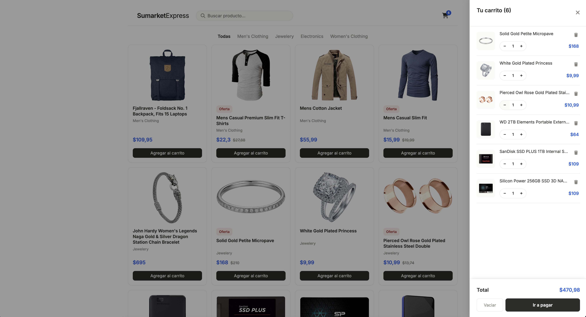
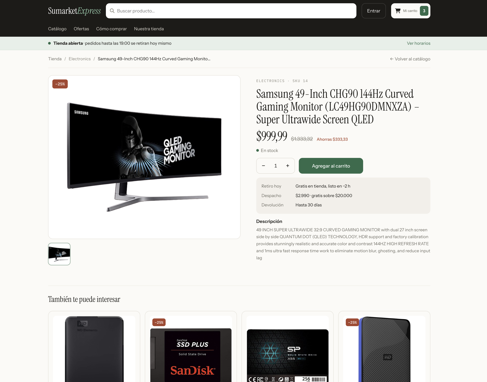

# 🛒 SumarketExpress

Tienda e-commerce de una sola página (SPA) construida desde cero con **React** y **Vite**, desarrollada como proyecto personal de aprendizaje con una **hoja de ruta full-stack**: el frontend actual es la primera etapa hacia una tienda completa con backend propio, autenticación, pagos y app móvil.

Los productos se obtienen en tiempo real desde una API externa pública y se normalizan a un formato propio antes de mostrarse en el catálogo. Incluye enrutamiento del lado del cliente (con página de detalle por producto), buscador, filtros por categoría y un carrito de compras completo —como panel lateral (drawer)— con persistencia en el navegador. La lógica de estado usa patrones avanzados de React (**custom hooks**, **`useReducer`** y **Context**) y cuenta con **tests unitarios**.

## 🔗 Demo en vivo

👉 [https://wdevil5.github.io/tienda-react/](https://wdevil5.github.io/tienda-react/)

## 📸 Vista previa






## 🛠️ Tecnologías

- **React 19** — Hooks (`useState`, `useEffect`, `useReducer`, `useContext`) y **custom hooks**
- **React Router** para el enrutamiento del lado del cliente (SPA)
- **Vite** como build tool y servidor de desarrollo
- **Vitest** + **React Testing Library** para tests unitarios
- **CSS Modules** + variables CSS (design tokens)
- **JavaScript (ES6+)**
- **[Fake Store API](https://fakestoreapi.com/)** como fuente de datos de productos
- **Font Awesome** para iconografía
- **Git** y **GitHub**
- **GitHub Pages** + **gh-pages** para el despliegue
- **Node.js + Express 5** para la API propia en construcción
- **Supertest** + `node:test` para pruebas de la API

## 🧩 Backend — en progreso

La API vive en `backend/` y se ejecuta como un proceso independiente del frontend. Esta separación permite evolucionar desde Fake Store hacia una fuente de datos propia sin reescribir la interfaz.

La base actual incluye:

- **Express 5** con `GET /api/health` para comprobar disponibilidad.
- Respuesta JSON consistente para rutas inexistentes (`404`) y un manejador central para errores inesperados (`500`).
- Encabezado `X-Request-Id` único por respuesta, preparado para trazabilidad y logs futuros.
- Configuración local con `.env` y plantilla segura `.env.example`; los valores locales no se suben al repositorio.
- Separación entre `src/app.js` (configura rutas y middlewares) y `src/server.js` (inicia el servidor), lo que permite probar la API de forma aislada.
- Módulo inicial de productos con datos temporales en memoria, reglas de publicación y respuestas públicas seguras.
- `GET /api/productos` con búsqueda (`q`), categoría (`categoria`), ofertas (`ofertas=true`) y paginación (`page` / `limit`), además de `GET /api/productos/:slug` para detalle.

> Aún no hay conexión a PostgreSQL ni integración entre React y la API. Fake Store continúa siendo la fuente de datos del frontend mientras se construye y valida el contrato propio.

## ✨ Características

### Catálogo y navegación

- **Catálogo de productos** obtenido desde una API externa con `fetch` dentro de `useEffect`, con estado de carga mientras llega la respuesta.
- **Manejo de errores de red**: si la petición falla o el servidor responde con error, se muestra un mensaje y un botón "Reintentar" (`catch` / `finally` sobre el `fetch`).
- **Normalización de datos**: la respuesta de la API se transforma al formato propio de la app, desacoplando la UI de la estructura externa.
- **Enrutamiento SPA con React Router**: rutas para el catálogo (`/`) y el **detalle de cada producto** (`/producto/:id`), con navegación por URL y botón "atrás" del navegador. Los *deep links* y el refresco funcionan en GitHub Pages gracias a un `404.html` (técnica spa-github-pages).
- **Buscador en tiempo real** mediante un input controlado.
- **Sugerencias de búsqueda** con productos y categorías; al llegar al catálogo, el término activo queda visible como chip removible.
- **Filtros por categoría** generados dinámicamente con `Set` (sin hardcodear), con el overflow agrupado en un desplegable "Explorar X más".
- **Ofertas reales derivadas** de `precioAnterior`: título con descuento máximo, filtro compartido entre CTA y catálogo, precio anterior tachado y tarjetas enlazadas a la ficha.
- **Banda de ofertas editorial y responsive**: el porcentaje y número de productos se derivan de los datos disponibles, con una composición adaptada para escritorio y móvil.
- **Paginación tipo "cargar más"** en tandas, indicando cuántos productos quedan.
- **Imágenes con red de seguridad**: un componente reutilizable muestra un placeholder elegante si la imagen externa falla (`onError`).

### Carrito de compras (panel lateral)

- **Agregar productos** (si ya existe, aumenta la cantidad en vez de duplicar la fila), con un **aviso flotante (toast)** de confirmación que se descarta solo.
- **Eliminar** productos y **ajustar cantidades** con `+` / `−` (mínimo 1 unidad).
- **Deshacer al eliminar**: el drawer conserva temporalmente el producto retirado y permite restaurarlo mediante un toast contextual.
- **Vaciar el carrito** con confirmación previa.
- **Subtotal por producto** y **total** calculados en tiempo real como **estado derivado**, sin duplicar información.
- **Persistencia en `localStorage`** (inicialización perezosa) para que el carrito sobreviva a un refresco de página.
- **Contador de ítems** en el ícono del header y en el título del panel.
- **Cada ítem enlaza a su página de producto** y cierra el panel al navegar.
- **Control de cantidad reutilizable** en el drawer y en el detalle de producto, con entrada manual validada.
- **UX del drawer**: se cierra con la tecla **Escape**, bloquea el scroll del fondo mientras está abierto, trunca nombres largos con elipsis y muestra un **estado vacío** con ícono y llamada a la acción.
- **Estado vacío útil**: los CTA del drawer llevan al catálogo completo o al catálogo filtrado por ofertas reales.

### Arquitectura, calidad y diseño

- **Estado global con Context API** (`CarritoProvider` + hook consumidor `useCarritoContext`), eliminando el *prop drilling*.
- **Lógica del carrito centralizada con `useReducer`** dentro de un **custom hook `useCarrito`** (acciones `AGREGAR`, `ELIMINAR`, `CAMBIAR_CANTIDAD`, `VACIAR`).
- **Tests unitarios con Vitest + React Testing Library** sobre el reducer del carrito.
- **Diseño responsive** para móvil, tablet y escritorio: grid adaptable (5 / 4 / 3 / 2 columnas) y header reorganizado en pantallas pequeñas.
- **Accesibilidad (ARIA)**: `aria-expanded`, `aria-controls`, `aria-label`, `role` de estado/alerta y respeto por `prefers-reduced-motion`.
- **Sistema de diseño propio** basado en design tokens (variables CSS para colores, espaciado y tipografía), con una estética minimalista y sobria.
- **Footer con navegación e identidad del proyecto**: enlaces por ancla, ofertas y hasta cuatro categorías reales derivadas del catálogo.
- **Marcas en góndola preparadas para assets locales**: los logos futuros vivirán en `public/marcas/` y su orden/visibilidad en `src/data/marcas.js`; no requieren backend ni panel de administración por ahora.

## 📚 Lo que aprendí

Este proyecto es mi campo de práctica para consolidar React y buenas prácticas de front-end. Además de los fundamentos, en esta etapa incorporé patrones más avanzados:

**Fundamentos**

- **Componentes reutilizables** y comunicación por **props** (con destructuring).
- Renderizado de listas con `map()` y uso correcto de `key` (y por qué `key={id}` importa para preservar el nodo del DOM).
- Estado con `useState`, efectos con `useEffect` y su función de **cleanup** (p. ej. `addEventListener` + `removeEventListener` para cerrar con Escape).
- **Estado derivado**: calcular valores (como el total del carrito) en vez de duplicarlos en el estado.
- **Inmutabilidad** con spread, `map` y `filter`; actualizadores `prev =>` para evitar *stale closures*.
- **Renderizado condicional** con `&&` y el ternario (incluido el *gotcha* de `0 &&` en JSX).
- Manejo de **inputs controlados** y encapsulamiento de estilos con **CSS Modules**.

**Patrones avanzados**

- **Custom hooks** para encapsular lógica con estado (`useCarrito`).
- **`useReducer`** para centralizar las transiciones de estado por acciones, testeable como función pura.
- **Context API** para estado global, eliminando el *prop drilling*.
- **React Router**: `Routes`/`Route`, `useParams`, `Link`, `BrowserRouter` con `basename`, y el fallback `404.html` para SPAs en GitHub Pages.
- **Testing** con Vitest + React Testing Library (función pura → test directo, `toBe` vs `toEqual`, patrón Arrange-Act-Assert).
- **Igualdad por referencia** aplicada a propósito (re-disparar un efecto pasando un objeto nuevo).
- Encapsular un comportamiento en un **componente reutilizable** para arreglar un bug en un solo lugar (el fallback de imagen).

**Otros**

- Consumo de **APIs externas** con `fetch`, `async` y manejo de estados de carga, error y reintento.
- **Paginación en el cliente** con constantes de configuración (en vez de números mágicos).
- **Accesibilidad** con atributos ARIA y `prefers-reduced-motion`.
- **Diseño responsive** con media queries, pensado para escalar a distintos tamaños de pantalla.

## 🗺️ Hacia dónde va (roadmap)

SumarketExpress es un proyecto **full-stack en construcción**, desarrollado por fases (una a la vez) para convertirse en una **tienda completa**:

- ✅ **Frontend estructurado**  — React con hooks, `useReducer`, Context, React Router y tests unitarios.
- 🟡 **Base del backend propio** — API REST con **Node.js + Express**, health check, errores, configuración local y pruebas iniciales.
- 🔜 **Datos propios** — contrato de productos, persistencia en **PostgreSQL** y decisión entre acceso directo con `pg` o un ORM (reemplaza a la API externa).
- 🔒 **Autenticación** — cuentas de usuario con **JWT** y contraseñas hasheadas con **bcrypt**; roles usuario/admin.
- 💳 **Pagos reales** — checkout con **Stripe / Mercado Pago** (modo test).
- 🛠️ **Panel de administración** — gestión de productos (con imágenes), pedidos e inventario de la tienda.
- 📱 **App móvil** — iOS y Android con **React Native + Expo**, compartiendo la misma API.

> El alcance detallado se mantiene en un documento de producto (PRD) aparte.

## 💻 Cómo ejecutarlo localmente

```bash
# Clonar el repositorio
git clone https://github.com/wDEVil5/tienda-react.git

# Entrar a la carpeta del proyecto
cd tienda-react

# Instalar las dependencias
npm install

# Levantar el frontend
npm run dev

# Ejecutar los tests del frontend
npm test
```

La aplicación quedará disponible en `http://localhost:5173/tienda-react/` (el proyecto usa un `base` propio, `/tienda-react/`, para el despliegue en GitHub Pages).

### API local

En una segunda terminal:

```bash
# Entrar a la API
cd backend

# Crear la configuración local una sola vez
cp .env.example .env

# Instalar dependencias de la API
npm install

# Iniciar la API en modo desarrollo
npm run dev

# Ejecutar sus pruebas
npm test
```

La API queda disponible en `http://localhost:3000`. Para comprobarla, abre `http://localhost:3000/api/health` y recibirás:

```json
{ "ok": true }
```

## 🚀 Cómo desplegarlo

El proyecto está configurado para desplegarse en GitHub Pages mediante `gh-pages`:

```bash
npm run deploy
```

Este comando genera el build de producción (`npm run build`) y publica el contenido de la carpeta `dist` en la rama `gh-pages` del repositorio.

---

Proyecto desarrollado por **Wilnes** ([@wDEVil5](https://github.com/wDEVil5)) como estudiante de Ingeniería en Computación e Informática, en el marco de mi proceso de aprendizaje de React.
